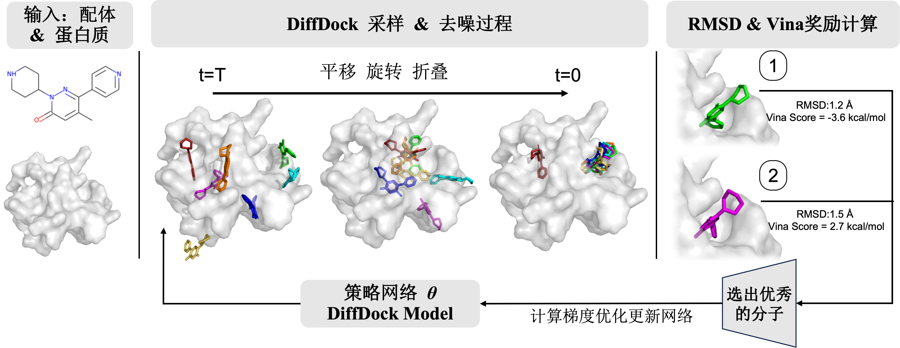

# PADDock

**P**hysical-**A**lignment **D**iffusion **Docking** via RL Post-training

PADDock is a reinforcement learning (RL) post-training framework for diffusion-based molecular docking models. Built on top of models such as DiffDock, it is designed to improve **physical plausibility** in terms of binding energy while preserving **geometric accuracy** in terms of RMSD.

## Overview

<div align="center">
  
</div>

PADDock targets the molecular docking setting, where geometric correctness and physical binding quality often need to be balanced carefully. The core workflow consists of:

1. Data preparation and optional embeddings
2. Optional cache pre-generation
3. RL post-training
4. Inference and sampling with the trained model

## Environment Setup

We recommend creating the environment from the provided `environment.yml` file:

```bash
conda env create -f environment.yml
conda activate PADDock
```

## Project Structure

- `train_ddpo.py`: main entry point for RL post-training
- `inference_rl.py`: main entry point for inference and sampling
- `pregenerate_cache.py`: optional cache pre-generation before training or inference
- `pick_trainset.py`: utility for selecting a compact and diverse training subset
- `datasets/`: scripts related to data and feature processing
- `workdir/`: directory for checkpoints and model weights
- `results/`: directory for training and inference outputs

## Model Checkpoints and Git LFS

Large model checkpoint files in this repository are tracked with Git LFS. To download them correctly, install Git LFS before cloning or pulling the repository:

```bash
git lfs install
git clone https://github.com/Roslyn1203/PADDock.git
cd PADDock
git lfs pull
```

If the repository has already been cloned without downloading LFS files, run:

```bash
git lfs pull
```

The main checkpoint files are stored under:

```text
workdir/paper_confidence_model/
workdir/paper_score_model/
```

If you only need the source code and want to skip downloading large checkpoint files, clone with:

```bash
GIT_LFS_SKIP_SMUDGE=1 git clone https://github.com/Roslyn1203/PADDock.git
```

You can later fetch the checkpoint files with `git lfs pull` when needed.

## Data Preparation

### Dataset

The data used by this project follows the DiffDock-Pocket data release:

- DiffDock-Pocket release: <https://github.com/plainerman/DiffDock-Pocket/releases/tag/v1.0.0>

Download the dataset from the release page, extract it, and place the extracted files under:

```text
./data
```

After extraction, the repository should contain the required PDBBind-style data directories and split files used by the training and inference scripts. Please ensure that all paths are consistent with your local configuration.

### ESM2 Embedding Preparation

To reproduce the paper-style DiffDock numbers and use protein language model features, generate ESM2 embeddings for the proteins before training.

First, prepare the FASTA file from the PDBBind structures:

```bash
python datasets/pdbbind_lm_embedding_preparation.py
```

This command generates:

```text
data/pdbbind_sequences.fasta
```

Next, install the official ESM repository from Meta AI:

```text
https://github.com/facebookresearch/esm
```

Inside the ESM repository, run:

```bash
python scripts/extract.py esm2_t33_650M_UR50D pdbbind_sequences.fasta embeddings_output --repr_layers 33 --include per_tok
```

This produces an `embeddings_output` directory. Copy this directory back into this repository so that the final path is:

```text
data/embeddings_output
```

Then convert the extracted ESM files into the packed `.pt` format used by this project:

```bash
python datasets/esm_embeddings_to_pt.py
```

By default, this creates:

```text
data/esm2_3billion_embeddings.pt
```

### Mini ESM Embedding File

If you only need a smaller ESM embedding file for selected train/validation/test splits, first generate or obtain the full `data/embeddings_output` directory as described above, then run:

```bash
python datasets/make_mini_esm.py \
  --esm_embeddings_path data/embeddings_output \
  --output_path data/esm2_3billion_embeddings_mini.pt \
  --split_files \
    data/splits/filtered_train \
    data/splits/filtered_val \
    data/splits/filtered_test
```

This packs only the protein-chain embeddings required by the specified split files.

## Optional: Cache Pre-generation

```bash
python pregenerate_cache.py
```

Running this step before training is recommended, as it can reduce waiting time during subsequent stages. Before execution, ensure that the relevant configuration and model files under `workdir/` are available.

## Training

Single-GPU training:

```bash
python train_ddpo.py
```

Example multi-GPU training:

```bash
torchrun --nproc_per_node=4 train_ddpo.py
```

Typical training outputs include:

- intermediate checkpoints, for example `rl_model_epoch_*.pt`
- training statistics, for example `training_stats.csv`
- additional experiment artifacts saved to the output directory configured in `train_ddpo.py`

## Inference

Batch inference with CSV input:

```bash
python inference_rl.py --protein_ligand_csv data/testset_csv.csv --out_dir results/rl_inference
```

Single-complex inference example:

```bash
python inference_rl.py \
  --complex_name 1a0q \
  --protein_path data/1a0q/1a0q_protein_processed.pdb \
  --ligand_description "CCCCC(NC(=O)CCC(=O)O)P(=O)(O)OC1=CC=CC=C1" \
  --out_dir results/rl_single
```

Common arguments:

- `--out_dir`: output directory
- `--protein_ligand_csv`: CSV file for batch inference
- `--complex_name` / `--protein_path` / `--ligand_description`: inputs for a single complex
- `--samples_per_complex`: number of samples generated per complex
- `--batch_size`: inference batch size
- `--inference_steps`: number of denoising steps

Inference results are written under `--out_dir`, typically in per-complex subdirectories containing generated `sample_*.sdf` files.

## Minimal Workflow

```bash
# 1. Optional: pre-generate cache
python pregenerate_cache.py

# 2. Train
python train_ddpo.py

# 3. Run inference
python inference_rl.py --protein_ligand_csv data/testset_csv.csv --out_dir results/rl_inference
```

## Acknowledgements

This project builds upon the excellent open-source work of **DiffDock** by G. Corso et al.

We thank the original authors for releasing their code and models to the community.

## License

This project is released under the MIT License.

Parts of this repository include modifications based on DiffDock. The original DiffDock project is also distributed under the MIT License.
